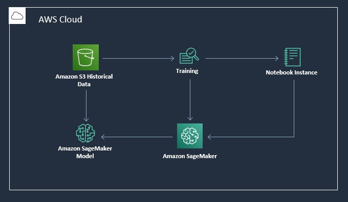

# Filling in Missing Values in Tabular Records

Missing data values are common due to omissions during manual entry or optional input. Simple data imputation such as using the median/mode/average may not be satisfactory. When there are many features, we can sometimes train a model to use the existing features to predict the desired feature. This solution uses an “AutoML” offering to train a model, deploy it as an endpoint, and then use this model to make bulk predictions. 

We use a data set of Fleet Inventory data and train a model to predict missing values in a target column.

## Requirements

You will need an AWS account to use this solution. Sign up for an account [here](https://aws.amazon.com/).

You will also need to have permission to use [AWS CloudFormation](https://aws.amazon.com/cloudformation/) and to create all the resources detailed in the [architecture section](#architecture). All AWS permissions can be managed through [AWS IAM](https://aws.amazon.com/iam/). Admin users will have the required permissions, but please contact your account's AWS administrator if your user account doesn't have the required permissions.

## Getting Started

Click on one of the following buttons to *quick create* the AWS CloudFormation Stack:

<table>
  <tr>
    <th colspan="3">AWS Region</td>
    <th>AWS CloudFormation</td>
  </tr>
  <tr>
    <td>US West</td>
    <td>Oregon</td>
    <td>us-west-2</td>
    <td align="center">
      
    </td>
  </tr>
</table>

You should acknowledge the use of the two capabilities and click 'Create Stack'. Once stack creation has completed successfully, click the 'SageMakerNotebookInstanceSignOn' link on the 'Outputs' tab. You can start by running the notebook '0_demo.ipynb'.

**Caution**: Cloning this GitHub repository and running the code manually could lead to unexpected issues! Use the AWS CloudFormation template. You'll get an Amazon SageMaker Notebook instance that's been correctly setup and configured to access the other resources in the solution.

## Architecture
As part of the solution, the following services are used:

* Amazon S3: Used to store datasets.
* Amazon SageMaker Notebook: Used to preprocess and process the data, and to train the deep learning model.
* Amazon SageMaker Endpoint: Used to deploy the trained model.

## License

This project is licensed under the Apache-2.0 License.

